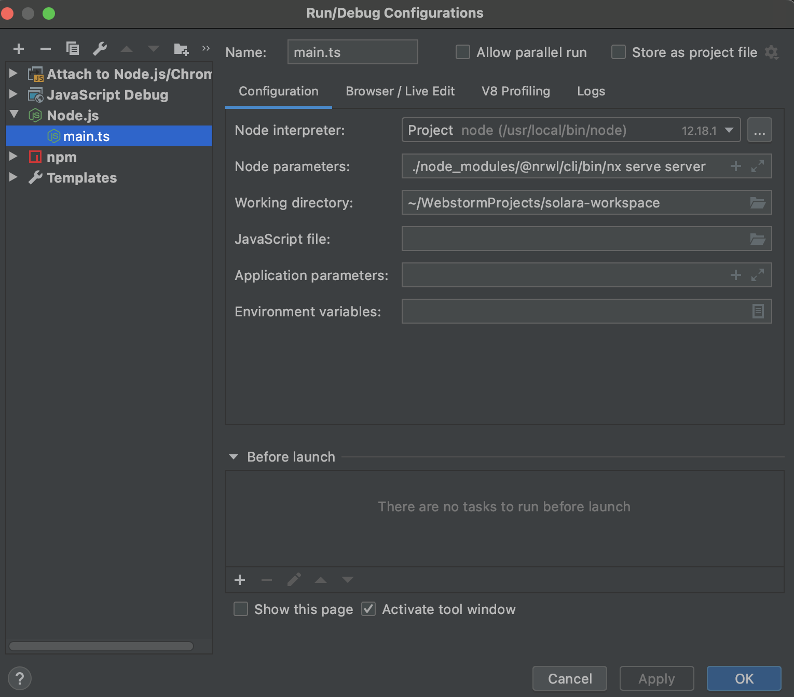

# SLR Workspace

This project was generated using [Nx](https://nx.dev).
Workspace is built with next technologies: 

- [Angular v12.0](https://angular.io)
- [NestJS v7.0](https://nestjs.com)
- [Bootstrap v5.0.1](https://getbootstrap.com/)

Libraries used in this workspace:
 - [socket.io-client](https://www.npmjs.com/package/socket.io-client) -> socket client
 - [joi](https://joi.dev/) -> The most powerful schema description language
    and data validator for JavaScript
 - [TypeORM](https://typeorm.io/#/) -> ORM for API
 
 
# Setup slr Workspace
Download application 

1. Run `npm install` to install dependencies.

2. Run `npm run client` to run web for "client" version.
3. Run `npm run server` to run application api.
 
## 🔎  **Important for developing!!!**

Workspace has shared data. It saved in `libs` folder.

Folder includes all shared data (styles, ui-elements, interfaces, model) that can be shared between 
front-end and back-end.

> **Also, there is `slr-ui` folder that includes main styles (ui elements) for project**

Angular app should have localization for a feature. So don't forget to create localization support on project setup.

> **If project will need to use [Angular material](https://material.angular.io/), `theming` or `custom-theme`
  should be defined in `slr-ui` library!**
   
## All data that can be used in 2 front-end apps, in front-end and back-end (such an interface, or some enum, or global styles) should be stored in `libs`!

## **Util** library.
There is a library `@util` that contain all util functions, such as Math (add, mul, toNumber), transform "toNumber", etc

> **If you will have some util features PLEASE save it in `util` library!**   

## API environmet
For now API is used `.env` files. There is 3 different environments:
1. `development.env` -> for local development
2. `test.env` -> for test server (amazon, docker, digitalocean etc.)
3. `production.env` -> for **production** deploy.
> `.env` files is stored in `./apps/server/environments` folder.
Also, there is  `@environemnt` library that exports `Environments` enum that contain all there 3 envs. Please use it as well.

## API debug
API is built with NestJS framework which is build on TypeScript.
So if you are using WebStorm you should to add new debug configuration.

You need to fill `node parameters` field as in a screenshot:
- `./node_modules/@nrwl/cli/bin/nx serve` -> use it as in screenshot
- `server` in " ./node_modules/@nrwl/cli/bin/nx serve server" is a name of your API in this workspace

> *do ot delete image from './common'

## NestJS schematics generators: 

- `nx g @nrwl/nest:service --project=server --name=<name>`
> it can be `controller`, `middleware`, `module`, `guard`, `pipe`,...
## Build project

Run `ng build client` to build the "client" project. The build artifacts will be stored in the `dist/` directory. Use the `--prod` flag for a production build.

## Add new `npm` pacakge
To add new package to project (workspace) use next:
- `npm install <package-name>`
After it u can use package in every nested project/
If package support front-end and back-end u can use in both, if only front-end (ui-element) there is no reason to use it in back-end.

## Quick Start & Documentation for Nx(@nrwl) Workspace

[Nx Documentation](https://nx.dev/angular)

[10-minute video showing all Nx features](https://nx.dev/angular/getting-started/what-is-nx)

[Interactive Tutorial](https://nx.dev/angular/tutorial/01-create-application)

There are also many [community plugins](https://nx.dev/nx-community) you could add.

## Generate an new application (admin panel, etc)

Run `ng g @nrwl/angular:app admin` to generate an application.

`admin` is a name of new application.
 
> You can use any of the plugins above to generate applications as well.

## Generate a shared data library

Run `ng g @nrwl/angular:lib my-lib` to generate an Angular library.
Run `nx g @nrwl/workspace:lib my-lib2` to generate library.
 
> You can also use any of the plugins above to generate libraries as well.

Libraries are shareable across libraries and applications. They can be imported from `@slr-workspace/mylib`.

## Code scaffolding

Run `ng g component my-component --project=my-app` to generate a new component.

## Running unit tests

Run `ng test my-app` to execute the unit tests via [Jest](https://jestjs.io).

Run `nx affected:test` to execute the unit tests affected by a change.

## Running end-to-end tests

Run `ng e2e my-app` to execute the end-to-end tests via [Cypress](https://www.cypress.io).

Run `nx affected:e2e` to execute the end-to-end tests affected by a change.

## Understand your workspace

Run `nx dep-graph` to see a diagram of the dependencies of your projects.

## Further help

Visit the [Nx Documentation](https://nx.dev/angular) to learn more.
